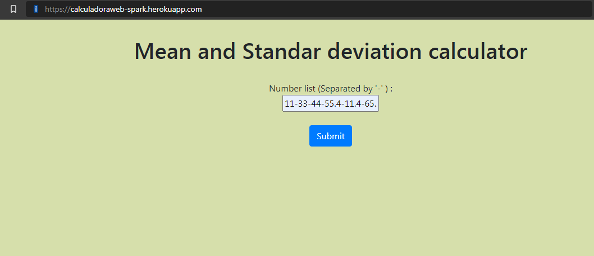
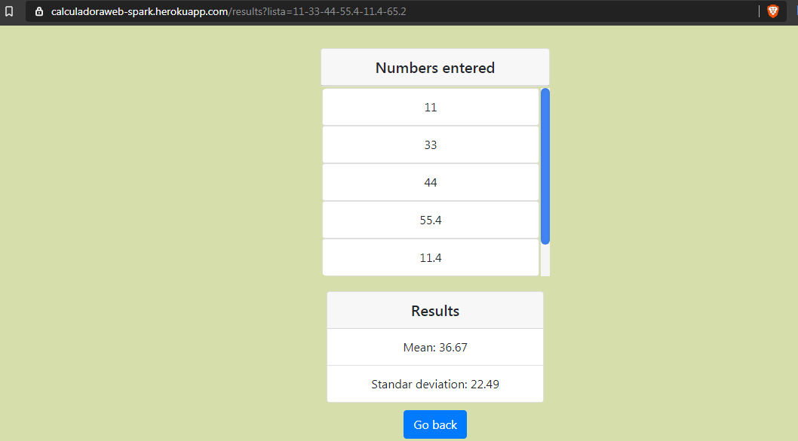
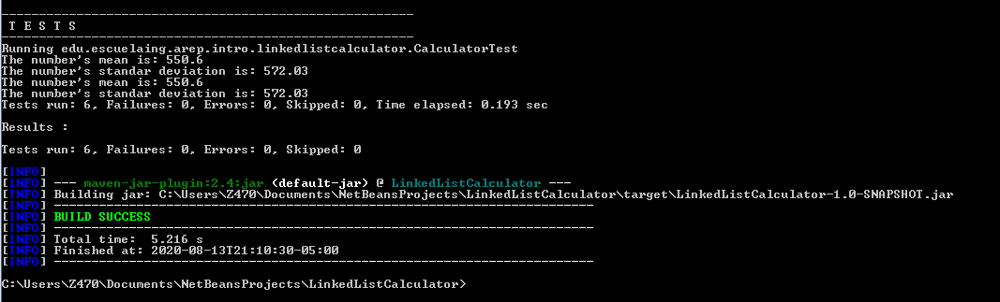
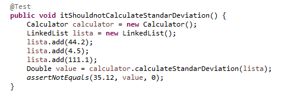
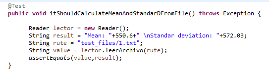
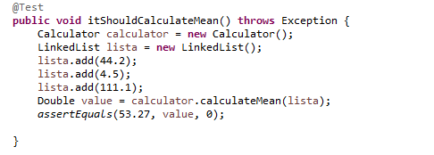
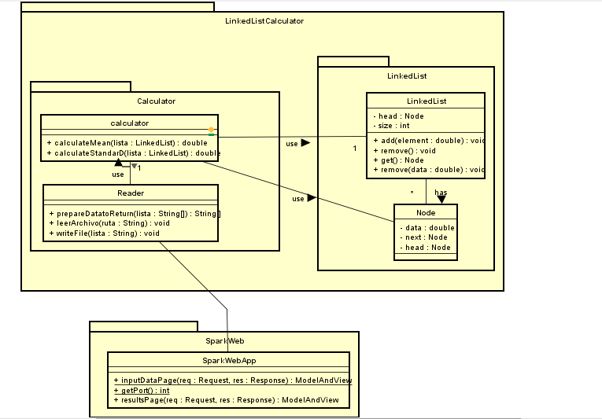

# Calculadora WEB

El siguiente repositorio es una extensión web de una calculadora estadistica que implementa las funcionalidades de calculo de media y desviación estandar a partir de una lista de números reales.

### Prerrequisitos

Para ejecutar con éxito este programa se requiere de los siguientes programas instalados en su máquina.

```
java version: "1.8.0_171"
git version: 2.19.1.windows.1
Apache Maven version: 3.6.3
```

## Instrucciones de uso

Para poder usar el proyecto lo primero que debe realizar es clonar este repositorio utilizando el siguiente comando desde la terminal del S.O que este utilizando:

```
git clone https://github.com/EdKillah/CalculadoraWEB
```
Otra alternativa es descargarlo directamente por formato ZIP en el botón que indica **"Clone or Download".**
Luego debe redirigirse por medio de la terminal al directorio raíz la cual contiene el achivo pom.xml.

Una vez se encuentre en este directorio se debe compilar el programa para esto se debe ejecutar el siguiente comando:

```
mvn package
```

Una vez compliado el repositorio completo se encuentra en posibilidad de probar los siguientes ejercicios:

### EJERCICIO

Calcular media y desviación estandar de una lista enlazada de números

#### Comando para ejecutar:
```
java -cp target/LinkedListCalculator-1.0-SNAPSHOT.jar edu.escuelaing.arep.linkedlistcalculator.calculator.Reader test_files/2.txt
```
#### Alternativa web (Más fácil):
Para ejecutar la aplicación puede ir al siguiente enlace dando click a continuación -> [Heroku](https://calculadoraweb-spark.herokuapp.com/)
o puede copiar la siguiente dirección:

**https://calculadoraweb-spark.herokuapp.com/**


Una vez se encuentre en la página se puede apreciar la página de inicio:




Para realizar el calculo debe ingresar los numeros separados por un guion "-" y darle en **Submit**.

Luego se cargará la página retornando la lista de números ingresados y sus respectivos calculos.



#### Pruebas:

Cuando se ejecuta el comando **mvn package** se compilan y ejecutan las pruebas que se encuentran en la clase ***SparkWebAppTest***


####  Algunas pruebas implementadas:

En la siguiente imagen se intenta probar un correcto calculo de la desviación estandar a partir de una lista que se crea en la prueba la cual es pasada a una calculadora para ejecutar el calculo.


En la siguiente imagen se prueba un calculo de la media y desviación estandar a partir de un archivo de texto almacenado en la carpeta test_files para comprobar la correcta lectura de archivos y funcionamiento de la calculdora.


En la siguiente imagen se prueba el calculo de la media de una lista con unos valores de prueba.



## Diagrama de clases

La siguiente imagen muestra los diagramas de clases que permiten la interacción entre la calculdora con la lista enlazada y además con el lector de archivo, se trato de mantener una responsabilidad simple entre cada clase para que fuera lo más eficiente posible.




## Construido con


* [Maven](https://maven.apache.org/) - Dependency Management
* [Heroku](https://www.heroku.com/) - Heroku
* [Java](https://www.java.com/es/download/) - Lenguaje de programación
* [Git](https://github.com/) - Versionamiento


## Authors

* **Eduard Jimenez**  - Fecha: 20/08/2020


## Licencia

This project is licensed under the MIT License - see the [LICENSE.md](LICENSE.md) file for details

## Enlace al sistema de integración continua

_A continuación se presenta el link:_
[](https://circleci.com/gh/EdKillah/)